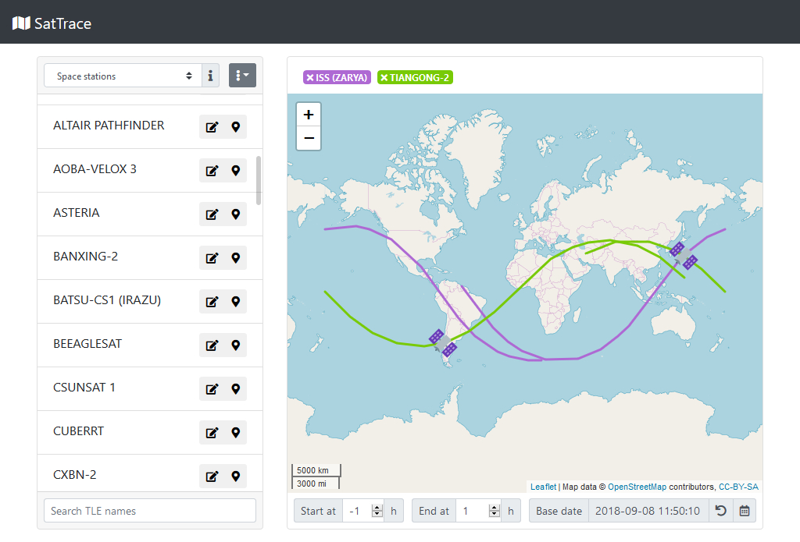

# SatTrace
This is a simple satellite tracker using Two-Line Element Sets (TLE), data can be input manually, of via plain text files found on [Celestrak](https://www.celestrak.com/) or [Space Track](https://www.space-track.org).  

### Instalation
Clone the repository then install [Node.js](https://nodejs.org) and [PostgreSQL](https://www.postgresql.org/).  
After that, modify the file [database/_config.json](database/_config.json) with your connection information and then rename it to `config.json` and run the database creation script on [database.sql](database.sql) (psql -f database.sql).  
Then finally, run `npm install` one time to download all dependencies, and `npm start` to run the server.